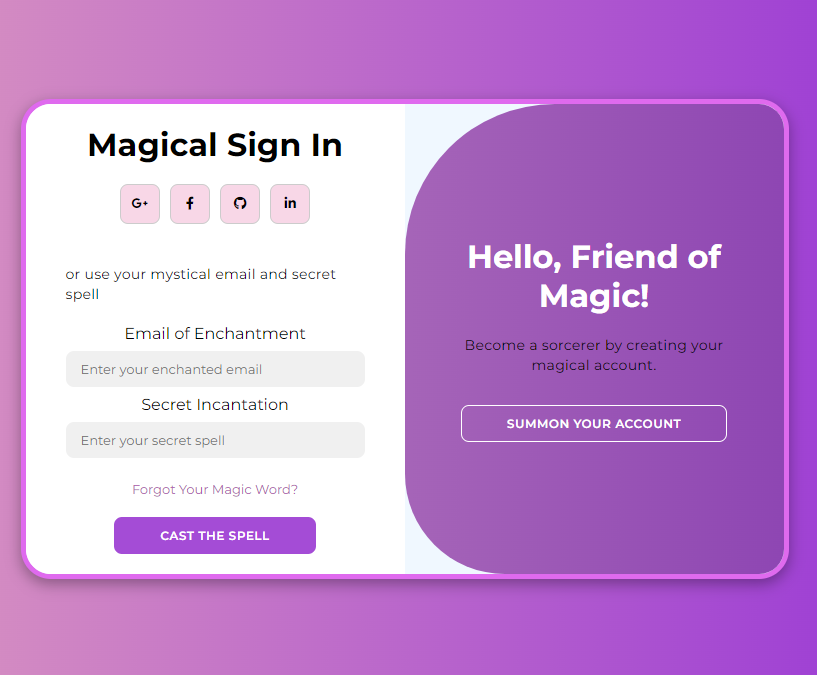

# MagicPortal - Modern Login Page

Welcome to the MagicPortal, a modern and enchanting login page designed to showcase my front-end development skills.

## Features:
- **Modern Design**: A visually captivating design with a magical theme.
- **Responsive Layout**: Adapts to various screen sizes ensuring a seamless user experience.
- **Smooth Transitions**: Experience smooth transitions when toggling between sign-in and sign-up forms.
- **Social Media Integration**: Provides options to sign in using Google, Facebook, GitHub, or LinkedIn.
- **Pure Front-end**: Built using pure HTML, CSS, and JavaScript without any frameworks.

## Preview:

## Usage:
1. Clone the repository.
2. Open `index.html` in your preferred browser.
3. Experience the magic!

Feel free to use this project as a template or inspiration for your own projects. If you have any suggestions or improvements, please submit a pull request or open an issue.
